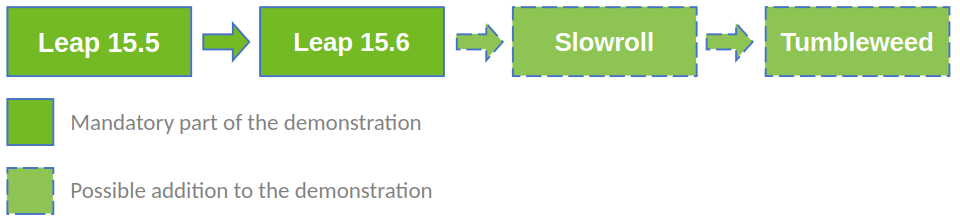

# Demo

In general, before attempting an OS upgrade, you should pay attention to some or all the items in the following list:

- it is always a good idea to make a backup at least of your data and why not of the system itself;
- execute the procedure while not in graphical mode. If your system is running a GUI, either switch to text mode (***multiuser.target*** or ***runlevel3.target***) or at least switch to a virtual console (for example, with ***Ctrl+Alt+F1***)
- decide what to do with any additional repositories that you may have registered. If they use a separate URL for the target OS version, switch to it. You can always leave them as they are and decide on package by package basis, if needed;
- it is always better to do a sequential upgrade compared to skipping versions;

These are the steps that are or could be part of the demo:



*Please note that the following instructions are more or less generic and should be adjusted to match your situation/case. It is advisable to try them in a virtual lab environment first to understand better what is involved and going on.*

## Upgrade from Leap 15.5 to Leap 15.6

*Use this document as a reference: https://en.opensuse.org/SDB:System_upgrade*

### Exploration (before)*

Do an initial check on where we are starting from:

```bash
cat /etc/os-release
```

```bash
uname -a
```

*\* This section can be skipped.*

### Preparation

Update system to the latest packages:

```bash
sudo zypper refresh
```

```bash
sudo zypper update
```

### Update repositories

Check if any of the registered repositories is not using the ***$releasever*** variable:

```bash
grep baseurl /etc/zypp/repos.d/*.repo | grep -v releasever
```

*We can always list all the repositories with their URL:*

```bash
zypper lr -u
```

*And, for example, remove a repository that we do not need:*

```bash
sudo zypper rr 1
```

*Note: The above assumes that the repository used during the installation is listed under number one and thus safe to delete. Double check before deleting a repository.*

Update the repositories to use the ***$releasever*** variable

```bash
sudo sed -i 's/15.5/${releasever}/g' /etc/zypp/repos.d/*.repo
```

*Note: You can change 15.5 to match your current version. However, please note that it is better to not skip versions.*

### Refresh the new repositories

Refresh with the new repositories:

```bash
sudo zypper --releasever=15.6 refresh
```

### Actual distribution upgrade

Execute the full distribution upgrade either with:

```bash
sudo zypper --releasever=15.6 dup
```

Or you can do the downloading and installation in heaps:

```bash
sudo zypper --releasever=15.6 dup --download-in-heaps
```

### Exploration (after)*

Do a check on where we came after the uprade:

```bash
cat /etc/os-release
```

```bash
uname -a
```

*\* This section can be skipped.*

## Convert Leap (or Tumbleweed) to Slowroll

*Use this document as a reference: https://en.opensuse.org/openSUSE:Slowroll*

### Preparation (from Leap)

Add a new repository:

```bash
sudo zypper ar https://download.opensuse.org/slowroll/repo/oss/ temp
```

And then install the repository-containing package:

```bash
sudo zypper in openSUSE-repos-Slowroll
```

### Preparation (from Tumbleweed)

Just remove the repository-containing package and install a new one:

```bash
sudo zypper in openSUSE-repos-Slowroll -openSUSE-repos-Tumbleweed
```

### Switch the repositories

Remove the existing repositories:

```bash
sudo rm /etc/zypp/repos.d/*.repo
```

*Note: You can always do a backup of the repositories before deleting them.*

### Convert the installation

Execute the actual conversion/migration:

```bash
sudo zypper dup
```

## Convert Slowroll to Tumbleweed

*In general, the procedure is similar to the already outlined **Convert Leap (or Tumbleweed) to Slowroll** above.*

Should you want to dig further and explore other options and possibilities, you can check either of these:

- https://en.opensuse.org/SDB:Upgrade_Tumbleweed
- https://en.opensuse.org/openSUSE:Migrate_Leap_to_Tumbleweed

### Preparation

Add a new repository:

```bash
sudo zypper ar https://download.opensuse.org/tumbleweed/repo/oss/ temp
```

And then remove the existing repository-containing package and install a new one:

```bash
sudo zypper in openSUSE-repos-Tumbleweed -openSUSE-repos-Slowroll
```

### Switch the repositories

Remove the existing repositories:

```bash
sudo rm /etc/zypp/repos.d/*.repo
```

*Note: You can always do a backup of the repositories before deleting them.*

### Convert the installation

Execute the actual conversion/migration:

```bash
sudo zypper dup
```